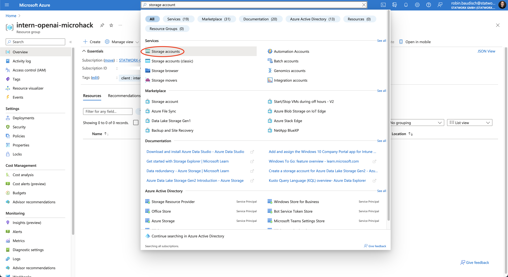
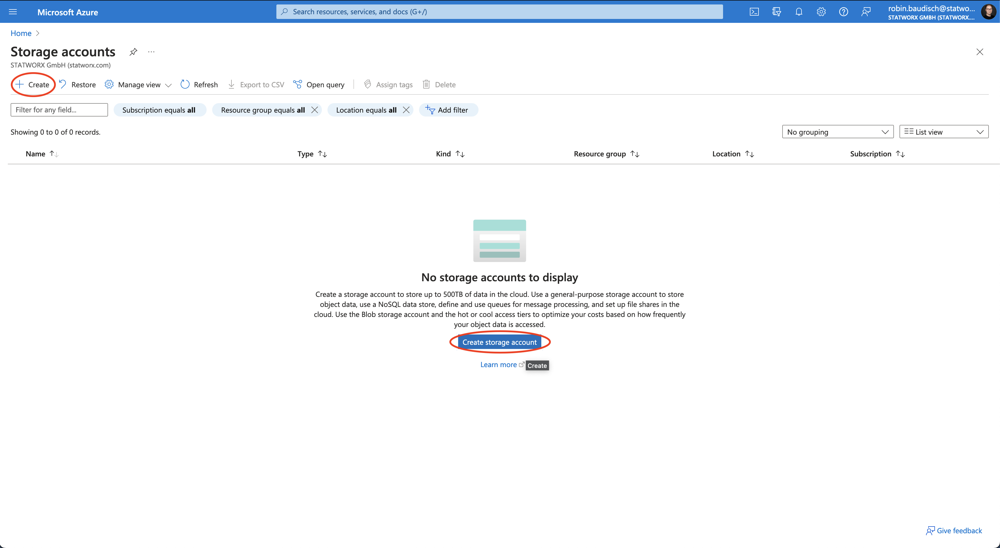
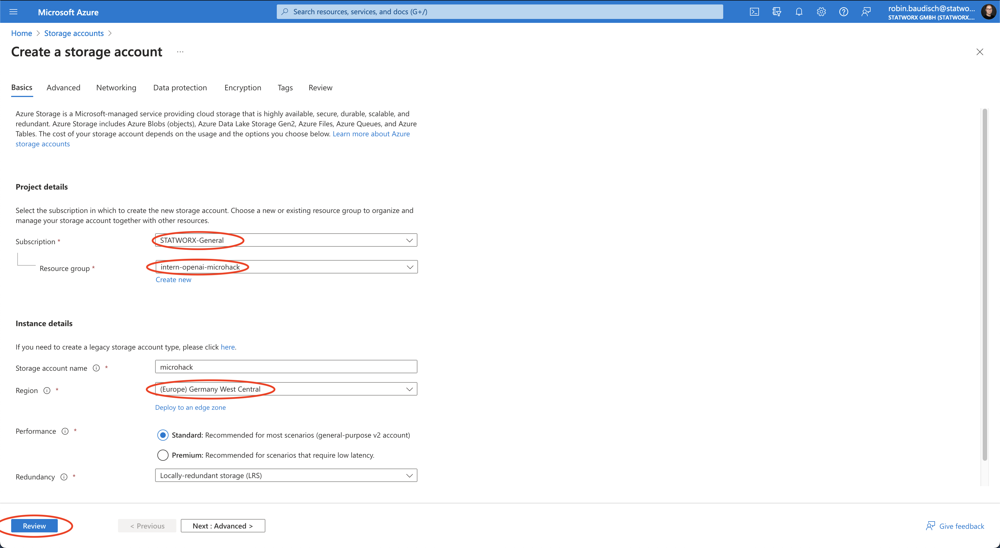
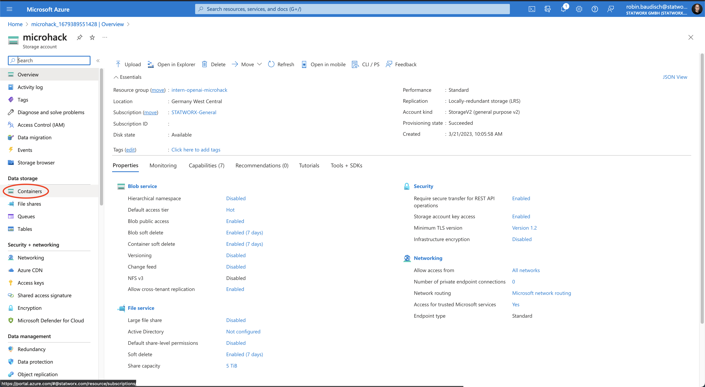
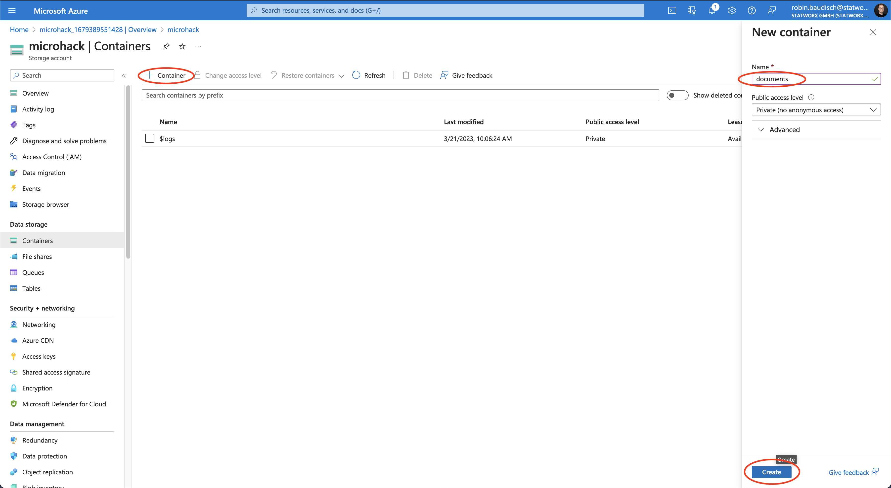

# Walkthrough Challenge 1 -  Use Azure Form Recognizer, Python and Azure Functions to process stored documents

Duration: **TBD**

**[Home](../../Readme.md)** - [Next Challenge Solution](../challenges/challenge-2/solution.md)

## Prerequisites

In order to complete Challenge 1, make sure to complete the Development Setup under [Link](../../Readme.md) and read through the [General Prerequisites](../../Readme.md#prerequisites). It is assumed that you already created an Azure Account with a valid Azure Subscription and a Resource Group for the MicroHack.

## Task 1: Create a Storage Account

**Resources:**

[Create Storage Account | Microsoft Learn](https://learn.microsoft.com/en-us/azure/storage/common/storage-account-create?tabs=azure-portal)\
[Quickstart: Create, download, and list blobs with Azure CLI](https://learn.microsoft.com/en-us/azure/storage/blobs/storage-quickstart-blobs-cli)\
\
A storage account provides a unique namespace in Azure for your data. Every object that you store in Azure Storage has an address that includes your unique account name. The combination of the account name and the Blob Storage endpoint forms the base address for the objects in your storage account.\
\
Under the MicroHack Resource Group, search for *storage account* in the search bar.

On the Storage Account subpage, either click on *+ Create* at the top of the page or on *Create storage account*.

On the configuration page, the correct Azure Subscription and Resource Group should have been automatically selected under *Project Details*. Under *Instance Details* you need to name the Storage Account and select a deployment region. Here, we selected **Germany West Central** since statworx is located in Frankfurt, Germany. It is, however, up to you where you want your Storage Account to be located. The selections for **Performance** and **Redundancy** are also up to you. Since we are only using this Storage Account for showcase purposes, low latency and high redundancy are not of primary concern to us. After you have given your storage account a name, selected the right deployment region and selected suitable performance and redundancy options, click on **Review**. We do not modify the standard selections under the tabs **Advanced**, **Networking**, **Data protection**, **Encryption** or **Tags**. If you are handling sensitive data or have specific networking needs, please consult the official Azure resources.

On the **Review** page, click on *Create* if you are happy with your configuration. It should take you to the deployment page of the storage account.

After the deployment page shows that the deployment was completed, click on *Go to resource*.

You are now seeing the main page of your newly created storage account. From the sidebar, under **Data storage**, select *Containers*.

A container organizes a set of blobs, similar to a directory in a file system. At the top of the page, click on *+ Container*. A sidebar should appear. Give your container a suitable name. Under *Public access level*, select the access level suitable for your use case and click on *Create*.

Your newly created container should now be selectable. You can now upload data by clicking on your container and selecting *Upload* at the top of the page.

If you want to use the Azure CLI for creating the storage account and uploading files, please refer to the resource at the beginning of the task.
## Task 2: Setup Azure Form Recognizer

## Task 3: Setup ElasticSearch/OpenSearch

## Task 4: Create the Azure Function

## Task 5: Write the Python Processing Script

## Task 6: Test your Pipeline

You successfully completed Challenge 1! 🚀
